# ZEON — Описание платформы и User Cases

## 1. Общее описание

**ZEON** — финтех-платформа для автоматизированного инвестирования в криптовалюты. Пользователи выбирают торговую стратегию, вносят капитал, а платформа автоматически торгует с помощью алгоритмических ботов. Платформа работает на стеке React/TypeScript (фронтенд), Express/Node.js (бэкенд), PostgreSQL (БД).

**Ключевое ценностное предложение:** «Деньги работают — вы отдыхаете». Пользователь выбирает уровень риска, вносит USDT и получает доходность от 1.8% до 12% в месяц через автоматический трейдинг.

---

## 2. Архитектура и модули

### 2.1 Торговый движок (Engine)
- **14 алгоритмических стратегий** для 7 криптовалют (BTC, ETH, BNB, SOL, XRP, DOGE, ADA)
- Стратегии: squeeze breakout, leveraged momentum, EMA revert, grid scalping, trend pullback, range harvest, volume burst, spike catcher, Keltner revert и др.
- **Walk-Forward фильтр** — блокирует сделки, если скользящая вероятность win-rate или EV ниже порога
- Расчёт проскальзывания (slippageBps), комиссий (feesBps), автоматическое управление ордерами
- **Engine Events:** TICK_OK/TICK_FAIL, TRADE_OPEN/TRADE_CLOSE, DD_TRIGGER, daily_pnl, settlement

### 2.2 Система инвестиций
- **3 риск-тира:** LOW (Стабильный, 1.8–3.6%/мес), CORE (Активный, 3–6.5%/мес), HIGH (Агрессивный, 5–12%/мес)
- **Vault-система:** principal (вложено), profit (накопленная прибыль), taxes (резерв налогов)
- **Auto-Sweep:** автоматическое распределение процента прибыли между хранилищами
- **Машина состояний:** NOT_INVESTED → INVESTED_ACTIVE → WITHDRAWING

### 2.3 Финансовые операции
- **Пополнение:** USDT (TRC20), банковская карта (RUB → USDT конвертация)
- **Инвестирование:** выбор стратегии, ввод суммы, подтверждение
- **Вывод:** 4-eyes workflow (PENDING_REVIEW → PENDING_APPROVAL → APPROVED)
- **Начисление прибыли:** автоматическое, отражается в позициях и equity-снимках
- **Все операции логируются** в таблице operations с полной историей

---

## 3. Пользовательские роли

### 3.1 Неавторизованный пользователь
- Видит лендинг с описанием платформы
- Может пройти демо-флоу
- Может зарегистрироваться/авторизоваться

### 3.2 Авторизованный пользователь (Инвестор)
- Полный доступ к платформе после прохождения онбординга и KYC

### 3.3 Демо-пользователь
- Получает сессию с предзаполненными данными (10,000 USDT, позиции, история)
- Полный доступ к интерфейсу без реальных денег

### 3.4 Администратор
- Управление пользователями, KYC, выводами, инцидентами
- Мониторинг движка, аудит-логи

---

## 4. Полный каталог User Cases

### UC-01: Знакомство с платформой (Лендинг)
**Актор:** Неавторизованный пользователь
**Цель:** Узнать о платформе и начать использование
**Сценарий:**
1. Пользователь открывает сайт
2. Видит hero-секцию «Приумножайте капитал с интеллектуальными стратегиями»
3. Просматривает 4 карточки преимуществ (Портфель, Стратегии, Кошелёк, Безопасность)
4. Нажимает «Войти» (авторизация) или «Попробовать демо» (демо-флоу)

**Экран: Лендинг — Hero-секция**

**Экран: Лендинг — Карточки преимуществ**
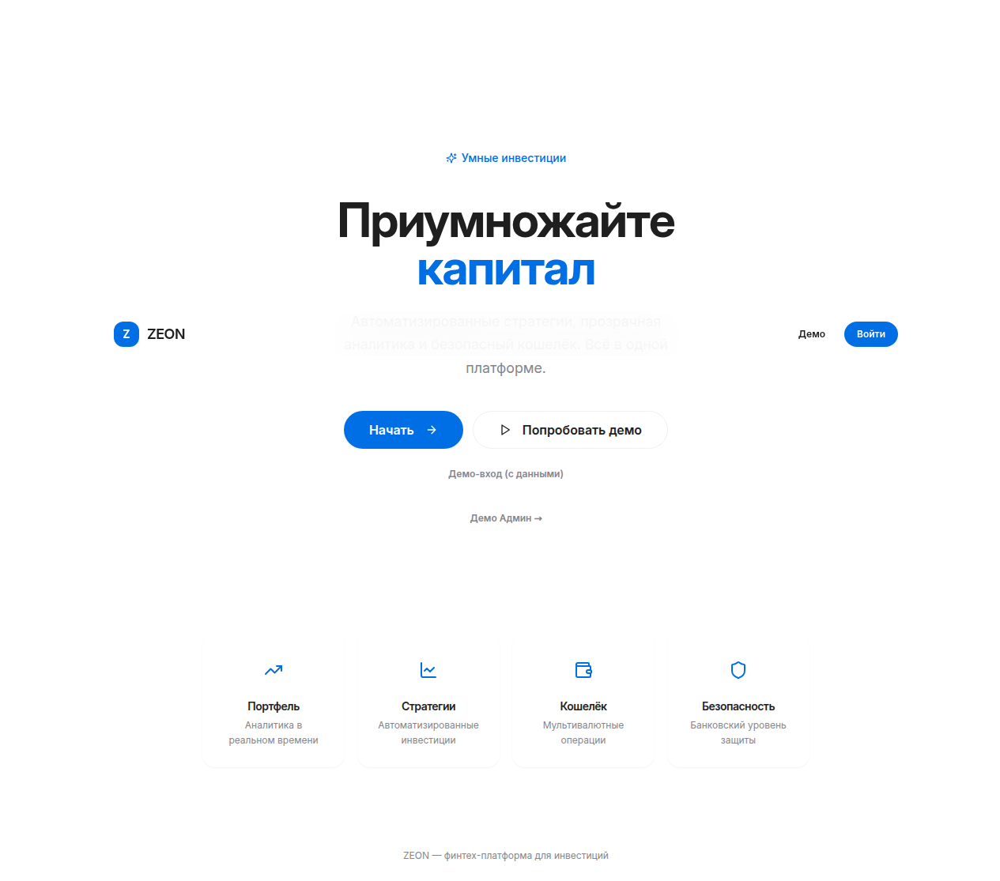

---

### UC-02: Демо-флоу (Пробный прогон платформы)
**Актор:** Потенциальный пользователь
**Цель:** Оценить платформу без регистрации и вложений
**Сценарий:**
1. Нажимает «Демо» на лендинге → переход на /demo/register
2. **Регистрация:** вводит телефон и email, подтверждает OTP-кодом (1234)
3. **Анкета (Risk Profiling):** 4 вопроса — опыт, реакция на просадку 20%, горизонт, доля портфеля
4. **Рекомендация стратегии:** система рассчитывает балл и рекомендует тир:
   - Балл ≤ 4 → Стабильный
   - Балл ≤ 8 → Активный
   - Балл > 8 → Агрессивный
   - Пользователь может выбрать другую
5. **Способ пополнения:** выбор между картой и криптовалютой
6. **Пополнение:** ввод суммы на цифровой клавиатуре, подтверждение
7. **Живой портфель:** видит реалтайм-симуляцию роста баланса (тики каждые 60мс = 30 мин реального времени)
8. **Конверсия:** нажимает «Открыть портфель» → создание реальной демо-сессии → попадает на настоящий экран Портфеля с данными
**Альтернативный путь:** Кнопка «Демо-вход (с данными)» на лендинге — мгновенный вход с предзаполненными данными, без прохождения анкеты

**Экран: Шаг 1 — Демо-регистрация**
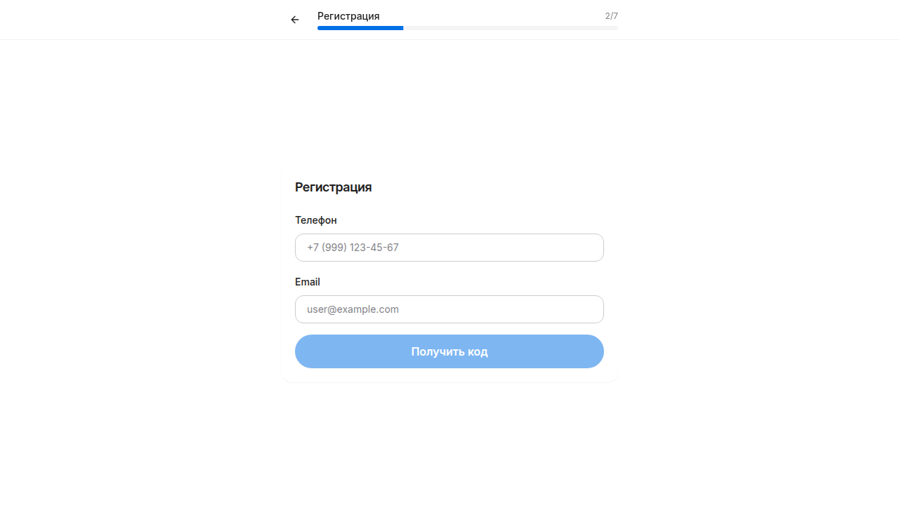

**Экран: Шаг 2 — Анкета (Risk Profiling)**
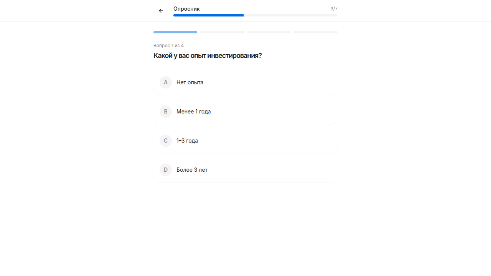

**Экран: Шаг 3 — Рекомендация стратегии**
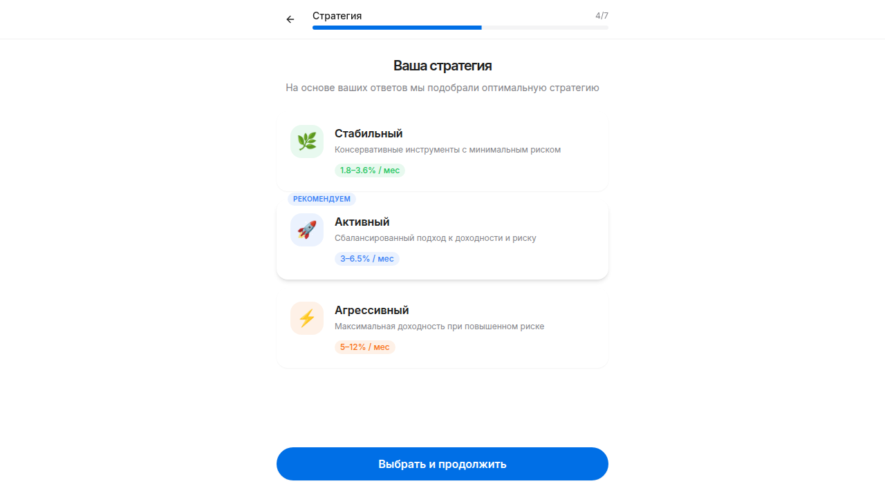

**Экран: Шаг 4 — Способ пополнения**
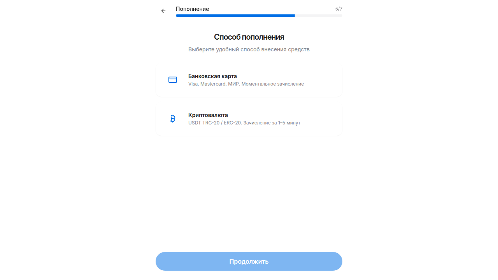

**Экран: Шаг 5 — Ввод суммы пополнения**
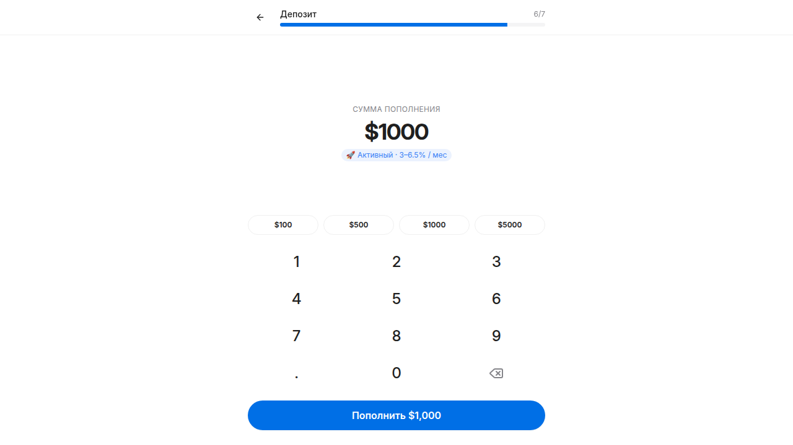

**Экран: Шаг 6 — Живая симуляция портфеля**
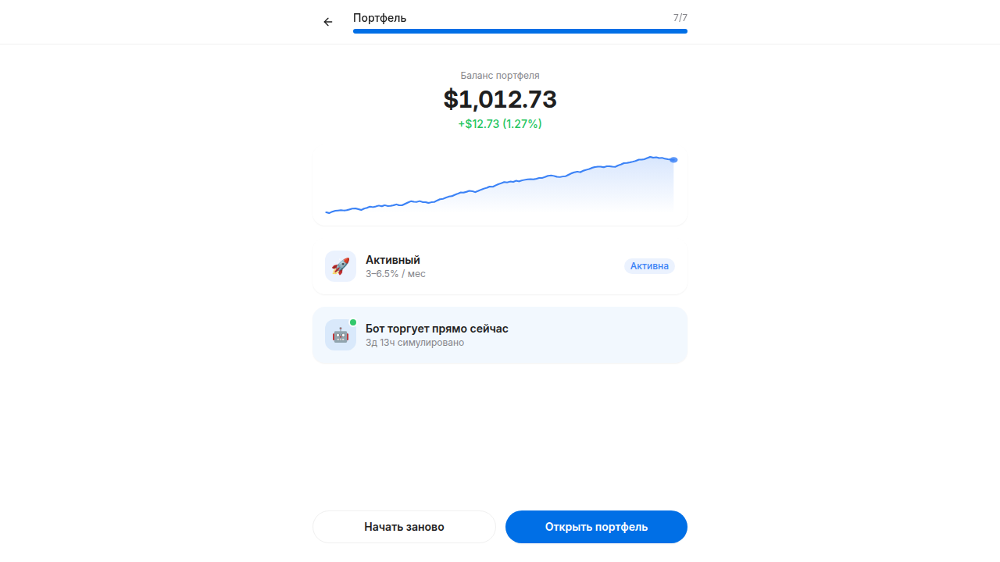

---

### UC-03: Регистрация и онбординг
**Актор:** Новый пользователь
**Цель:** Создать аккаунт и пройти верификацию
**Сценарий:**
1. Нажимает «Войти» → авторизация через Replit OIDC
2. **Верификация контакта:** получает код, вводит для подтверждения
3. **Правовое согласие:** принимает Условия использования и Политику конфиденциальности (версионируется, с таймстемпом)
4. **KYC (Верификация личности):**
   - Статусы: NOT_STARTED → IN_REVIEW → APPROVED / NEEDS_ACTION / REJECTED
   - В демо: автоматическое одобрение через 2 секунды
   - В продакшене: попадает в очередь на ревью администратора
5. **Smart Start (опционально):** анкета для определения риск-профиля и рекомендации стратегии
6. **ДУ-декларация (опционально):** подписание декларации доверительного управления
7. Попадает на главный экран Портфеля

**Экран: Онбординг**
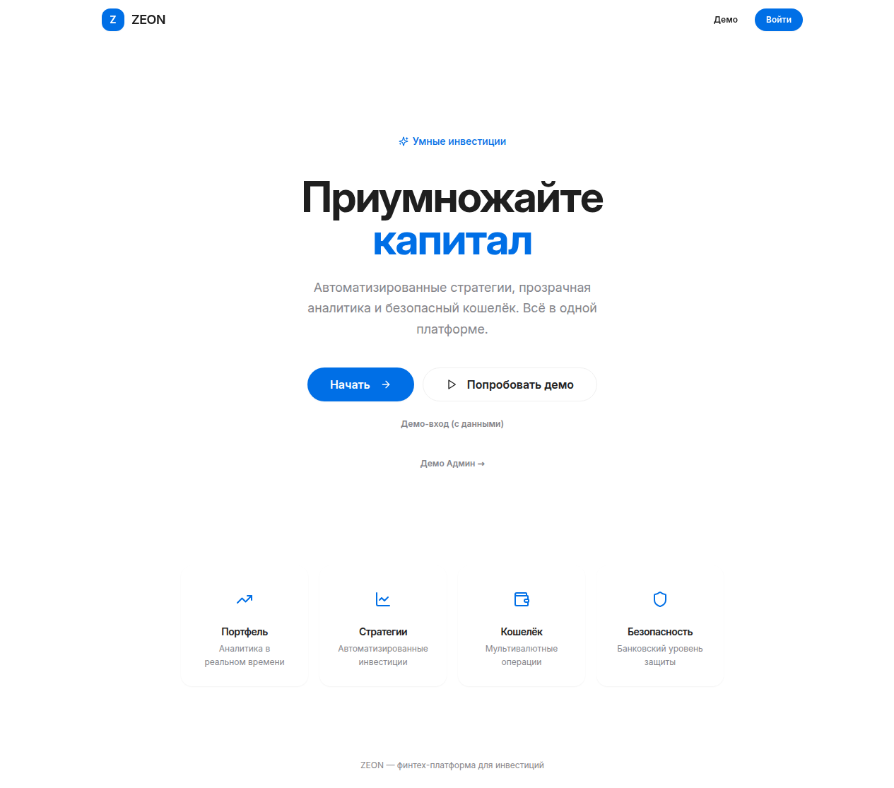

---

### UC-04: Просмотр портфеля
**Актор:** Авторизованный пользователь
**Цель:** Отслеживать свои инвестиции
**Сценарий:**
1. Открывает экран «Портфель» (/)
2. Видит общий баланс в USDT
3. Видит изменение за день (абсолютное и процентное)
4. Кнопки «Пополнить» и «Вывести»
5. Секция «Инвестиции» — список активных позиций с P&L
6. График «Рост портфеля» с переключателем периода (7Д, 30Д, 90Д, 1Г)
7. Фильтры: Q1F (портфель), BTC benchmark, S&P 500 benchmark

**Экран: Главный портфель**
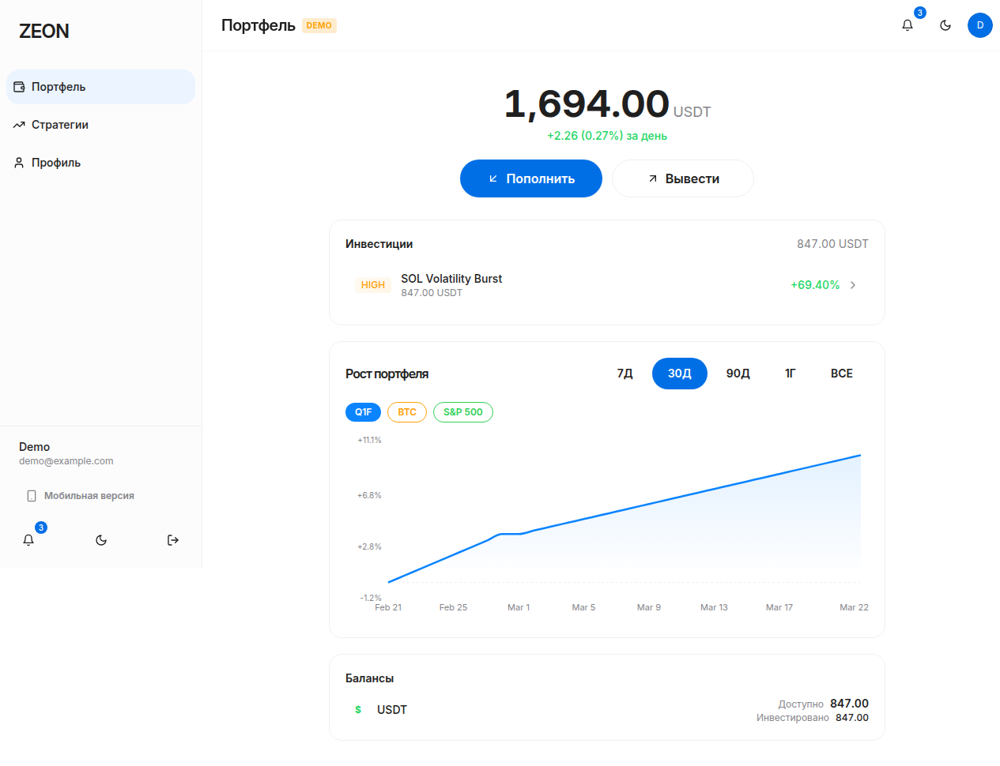

---

### UC-05: Выбор и инвестирование в стратегию
**Актор:** Авторизованный пользователь
**Цель:** Вложить средства в алгоритмическую стратегию
**Сценарий:**
1. Переходит в «Стратегии» (/strategies)
2. Видит 3 карточки стратегий с сегментным переключателем (Стабильный / Активный / Агрессивный)
3. Для каждой стратегии видит:
   - Название, эмодзи, тегировка
   - Доходность (мин–макс % в месяц)
   - Sparkline-график роста
   - Калькулятор: выбирает сумму (500/1K/5K/10K) → видит прогноз на 3/6/12 месяцев
4. Нажимает «Начать зарабатывать»
5. **Инвестиционный шит:**
   - Выбор уровня риска (LOW / CORE / HIGH)
   - Видит ожидаемую доходность и макс. просадку
   - Вводит сумму (доступный баланс показан)
   - Нажимает «Продолжить»
6. **Подтверждение:**
   - Видит сумму, комиссию, баланс до/после
   - Нажимает «Инвестировать»
7. **Результат:** «Инвестиция выполнена» → кнопка «Готово» → возврат на Портфель

**Экран: Каталог стратегий**
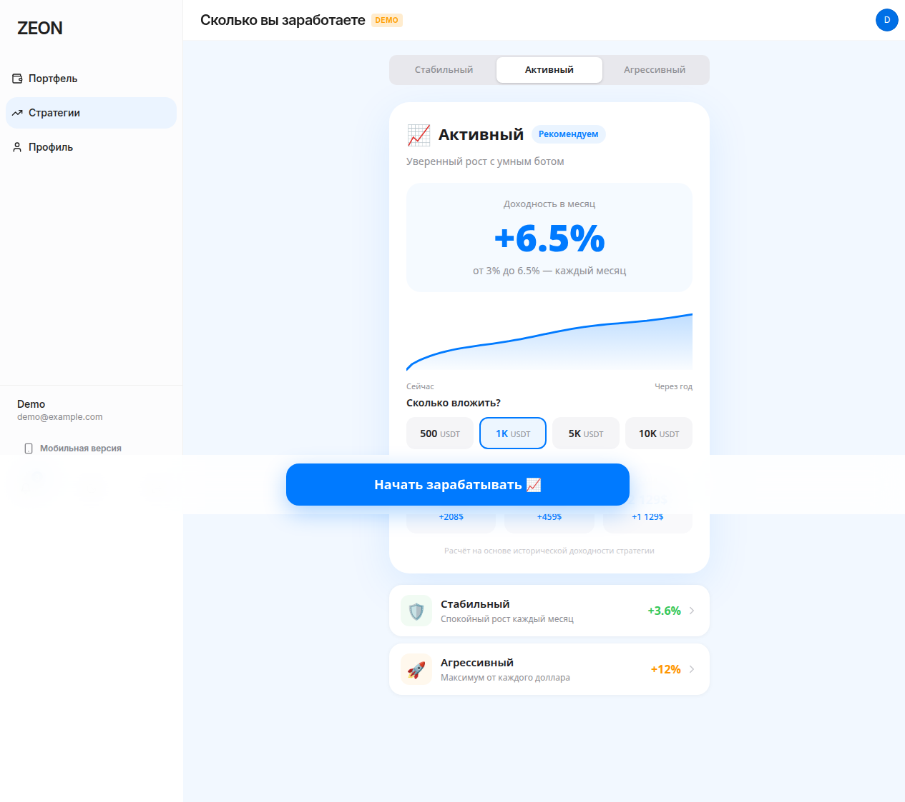

**Экран: Инвестиционный шит (выбор суммы)**
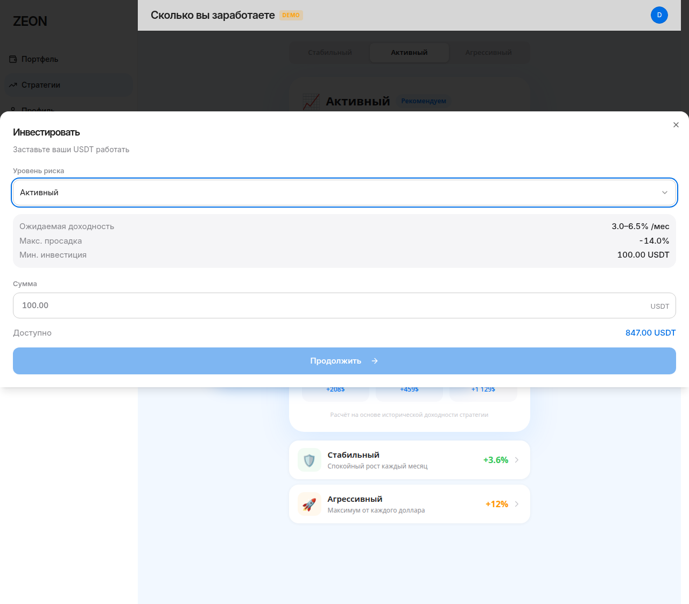

---

### UC-06: Детальный просмотр стратегии
**Актор:** Авторизованный пользователь
**Цель:** Изучить стратегию перед инвестированием
**Сценарий:**
1. Переходит на /invest/:id
2. Видит:
   - Свечной график (candlestick) с реальными рыночными данными
   - Обзорную статистику: доходность, Sharpe ratio, max drawdown
   - Историю сделок бота (дата, сторона, цена входа/выхода, P&L)
   - Live-метрики (для активных позиций)
3. Может инвестировать прямо со страницы стратегии

---

### UC-07: Пополнение счёта (USDT)
**Актор:** Авторизованный пользователь
**Цель:** Внести средства на платформу
**Варианты:**

**A. Через крипто (USDT TRC20):**
1. Переходит в «Кошелёк» → «Пополнить»
2. Видит адрес для пополнения (TRC20)
3. Кнопка копирования адреса
4. Предупреждение: отправлять только USDT TRC20, мин. депозит
5. Симуляция пополнения (для тестирования)
6. После успеха → возврат на Портфель

**B. Через банковскую карту (RUB):**
1. Переходит на /deposit/card
2. Вводит сумму в рублях
3. Видит текущий курс USDT/RUB
4. Подтверждает → конвертация → зачисление в USDT
5. После успеха → возврат на Портфель

**Экран: Пополнение USDT (крипто)**
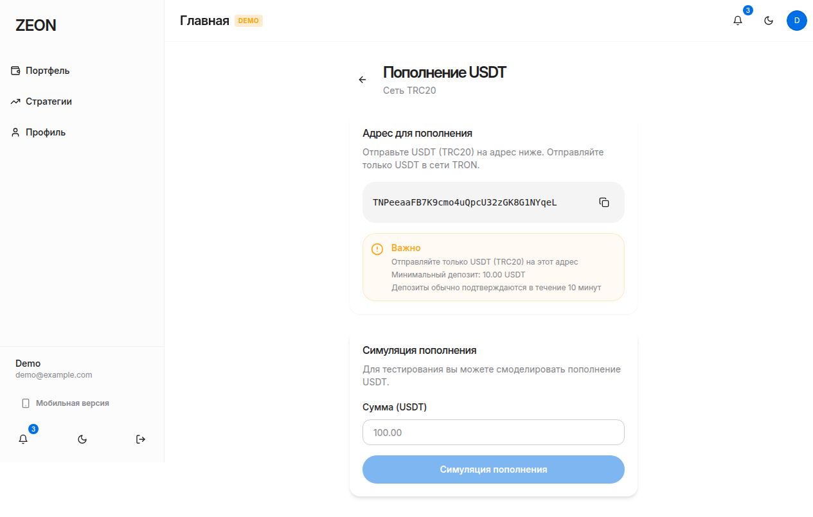

---

### UC-08: Вывод средств
**Актор:** Авторизованный пользователь
**Цель:** Вывести средства с платформы
**Сценарий:**
1. Переходит на /withdraw
2. Вводит сумму вывода
3. Указывает адрес (или выбирает из белого списка)
4. Видит комиссию сети и итоговую сумму
5. Подтверждает (может потребоваться 2FA)
6. Операция получает статус PENDING_REVIEW
7. **Maker-Checker:** администратор проверяет и одобряет вывод
8. Средства отправляются, пользователь получает уведомление
9. После успеха → возврат на Портфель

---

### UC-09: Управление хранилищами (Vaults)
**Актор:** Авторизованный пользователь
**Цель:** Распределить средства между хранилищами
**Сценарий:**
1. Переходит в «Кошелёк» → «Хранилища» (/wallet/vaults)
2. Видит 3 хранилища: Principal, Profit, Taxes
3. Может переводить средства между хранилищами
4. Настроить Auto-Sweep процент

**Экран: Кошелёк**
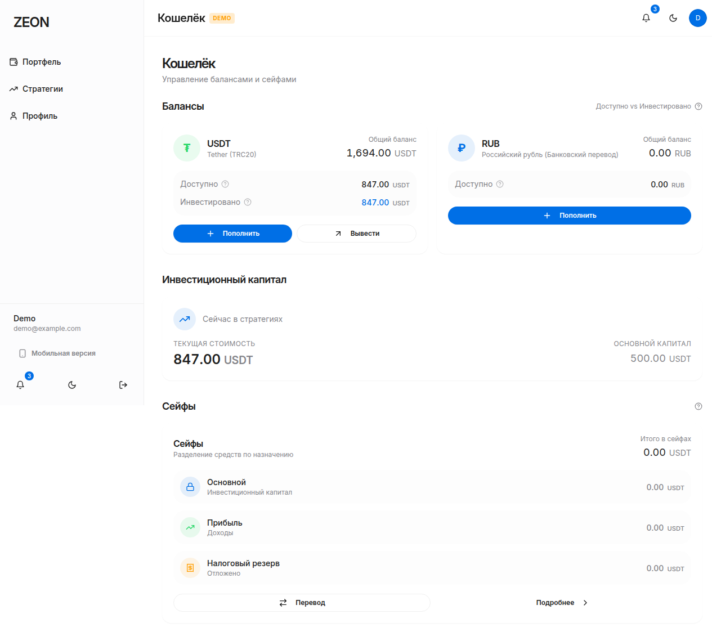

---

### UC-10: Просмотр активности и истории операций
**Актор:** Авторизованный пользователь
**Цель:** Отслеживать все события и транзакции

**A. Лента событий (/activity):**
- Engine-события: daily_pnl, settlement, deposit, withdrawal
- Торговые события: открытие/закрытие позиций
- Фильтрация по типу и дате

**B. История транзакций (/activity/transactions):**
- Все операции: депозиты, инвестиции, начисления прибыли, выводы
- Статусы: pending, completed, failed
- Детали каждой операции с квитанцией (/activity/:operationId)

**Экран: Активность**
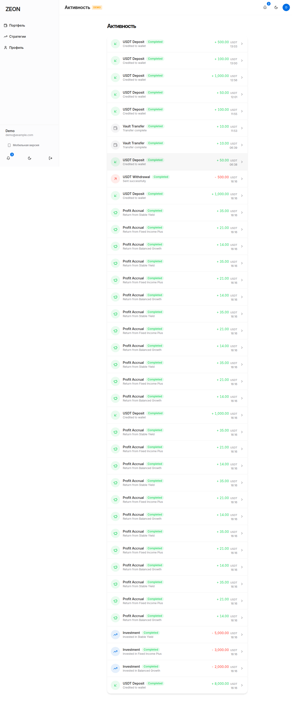

---

### UC-11: Управление риском
**Актор:** Авторизованный пользователь
**Цель:** Настроить параметры риска для стратегий
**Сценарий:**
1. Переходит на /risk
2. Для каждой стратегии может настроить:
   - Максимальная просадка (maxDrawdownBps)
   - Максимальный дневной убыток (maxDailyLossBps)
   - Максимальное число сделок в день
   - Авто-пауза при нарушении правил
3. При срабатывании правила — стратегия автоматически приостанавливается

**Экран: Управление рисками**
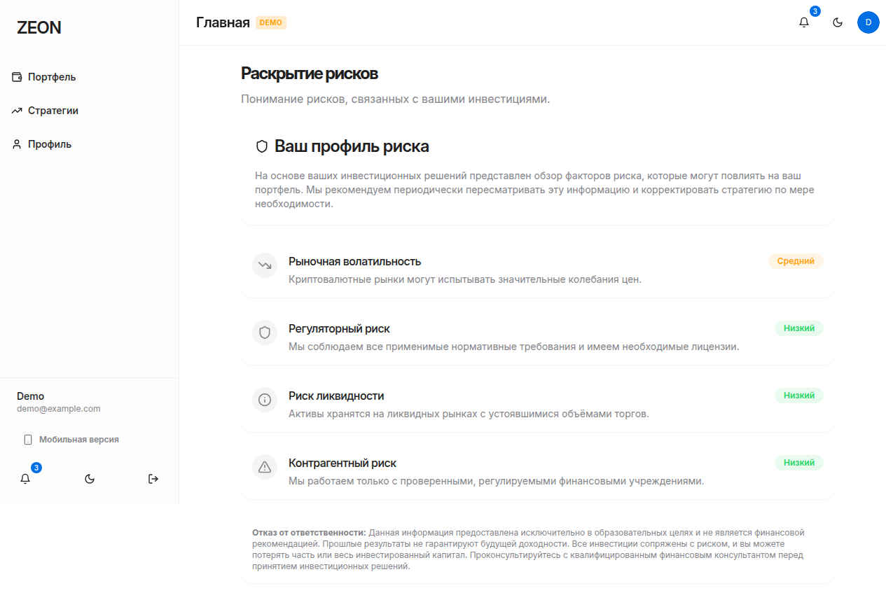

---

### UC-12: Настройки безопасности
**Актор:** Авторизованный пользователь
**Цель:** Защитить аккаунт
**Сценарий:**

**A. Двухфакторная аутентификация (2FA):**
1. Переходит в «Настройки» → «Безопасность»
2. Включает 2FA: сканирует QR-код в приложении (TOTP)
3. Вводит 6-значный код для подтверждения
4. 2FA запрашивается при: выводах, добавлении адресов, отключении 2FA

**B. Белый список адресов:**
1. Включает функцию
2. Добавляет TRC20 адреса (с подтверждением 2FA)
3. Новые адреса имеют задержку активации (addressDelay, напр. 24 часа)
4. Выводы возможны ТОЛЬКО на адреса из белого списка

**C. Анти-фишинг код:**
1. Устанавливает уникальную строку
2. Этот код включается во все системные email-уведомления
3. Позволяет отличить реальные письма от фишинга

**Экран: Центр безопасности**
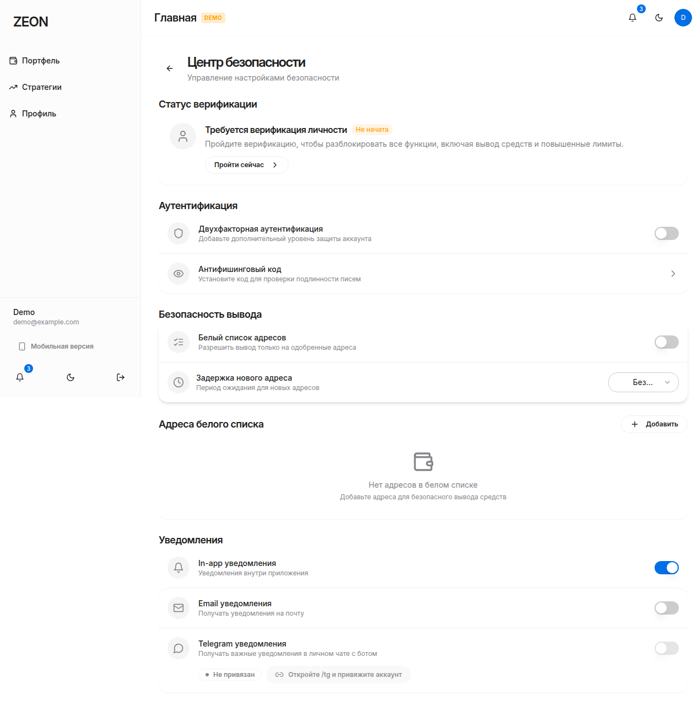

---

### UC-13: Управление профилем и уведомлениями
**Актор:** Авторизованный пользователь

**A. Профиль (/settings/profile):**
- Просмотр и редактирование личных данных
- Фото профиля

**B. Уведомления (/settings/notifications):**
- Настройка каналов: In-App, Email, Telegram
- Настройка типов: Транзакции, KYC, Безопасность, Системные

**C. Поддержка (/settings/support):**
- FAQ, обратная связь, контакты поддержки

**Экран: Настройки**
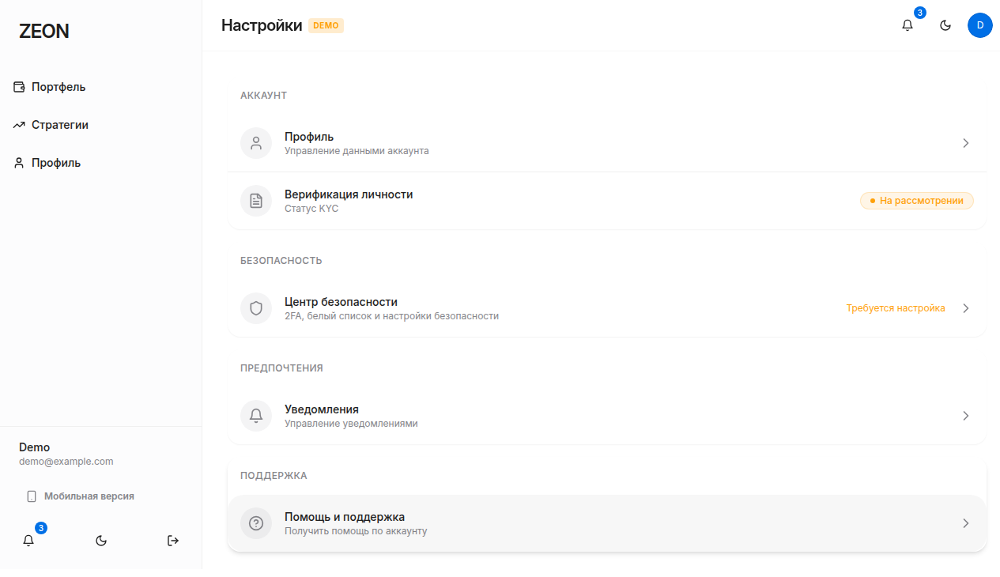

**Экран: Профиль**
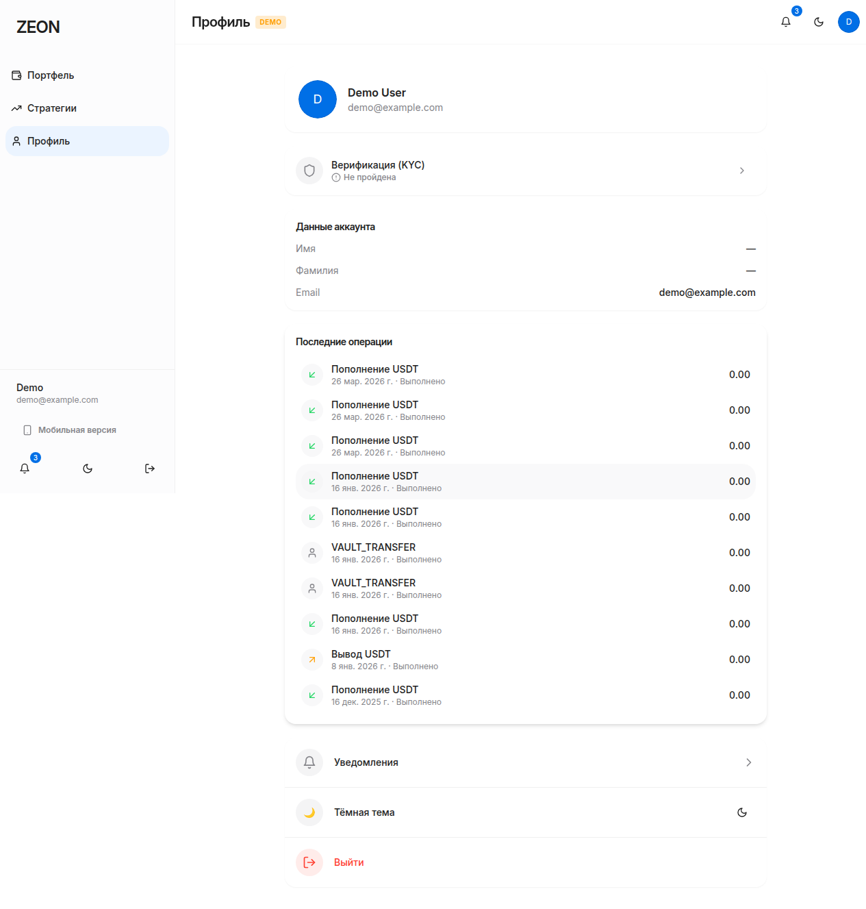

---

### UC-14: Просмотр отчётов и выписок
**Актор:** Авторизованный пользователь
**Цель:** Получить финансовую отчётность
**Сценарий:**
1. Переходит на /statements
2. Видит ежемесячные отчёты
3. Сводка по каждому периоду: P&L, комиссии, операции
4. Может скачать/просмотреть детальный отчёт

**Экран: Выписки**
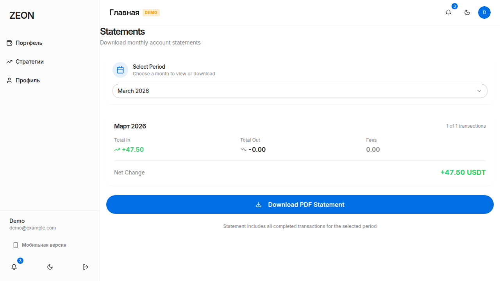

---

### UC-15: Статус системы
**Актор:** Авторизованный пользователь
**Цель:** Проверить работоспособность платформы
**Сценарий:**
1. Переходит на /status
2. Видит статус торгового движка
3. Список инцидентов (если есть)
4. Общее состояние систем

**Экран: Статус системы**
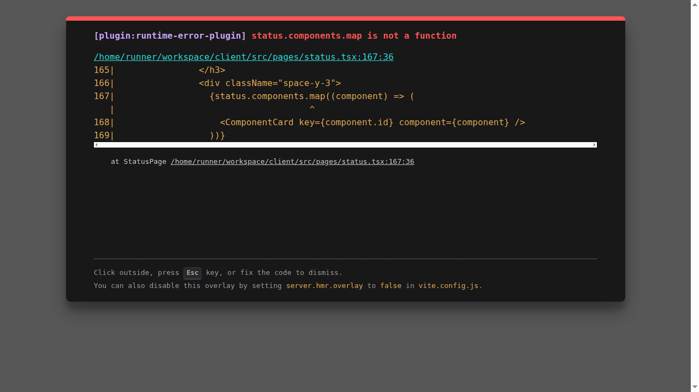

---

### UC-16: Уведомления и входящие
**Актор:** Авторизованный пользователь
**Цель:** Получать оповещения
**Сценарий:**
1. Иконка колокольчика в навигации показывает число непрочитанных
2. Нажимает → переходит в /inbox
3. Список уведомлений с CTA-ссылками (на операцию, KYC-страницу и т.д.)
4. Может отметить как прочитанное

**Экран: Входящие**
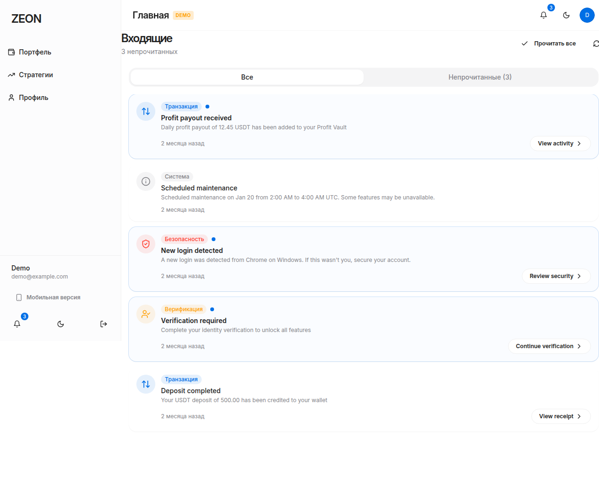

---

### UC-17: Telegram Mini App
**Актор:** Пользователь Telegram
**Цель:** Управлять инвестициями из Telegram
**Сценарий:**

**A. Привязка аккаунта:**
1. На платформе генерирует link-token
2. Отправляет в Telegram-бот
3. Аккаунт привязан

**B. Использование Mini App:**
1. Открывает Mini App из чата с ботом
2. Видит мобильный интерфейс: баланс, позиции, quick-действия
3. Может пополнять, инвестировать, смотреть графики
4. Аутентификация через Telegram initData + JWT

**C. Уведомления бота:**
- Оповещения о сделках, депозитах, событиях безопасности
- Прямо в чат Telegram

---

### UC-18: Q1F — Альтернативный мобильный интерфейс
**Актор:** Пользователь мобильного устройства
**Цель:** Управлять крипто-активами в мобильном формате
**Сценарий:**
1. Открывает /q1f
2. Видит 5 вкладок (bottom nav):
   - **Главная:** Баланс, быстрые действия (Купить, Обменять, Отправить, Получить), список активов
   - **Обмен:** Интерфейс обмена криптовалют
   - **AI Инвест:** 3 стратегии (Консервативная, Сбалансированная, Агрессивная)
   - **Кошелёк:** Баланс и операции
   - **Профиль:** Настройки и информация пользователя

**Экран: Q1F — Главная**
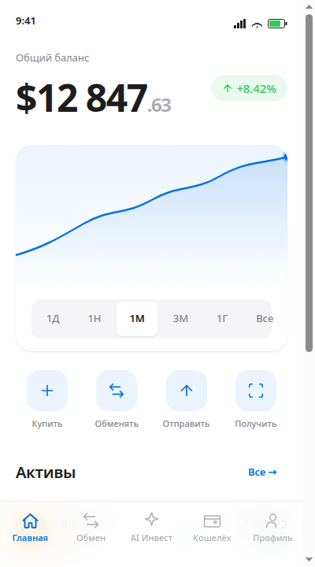

**Экран: Q1F — AI Инвест**
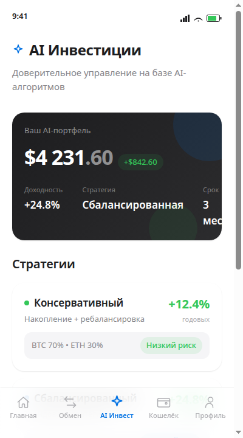

---

### UC-19: Аналитика
**Актор:** Авторизованный пользователь
**Цель:** Детально анализировать результаты
**Сценарий:**
1. Переходит на /analytics
2. Видит разбивку портфеля по стратегиям
3. Performance-метрики
4. Сравнение с бенчмарками

**Экран: Аналитика**
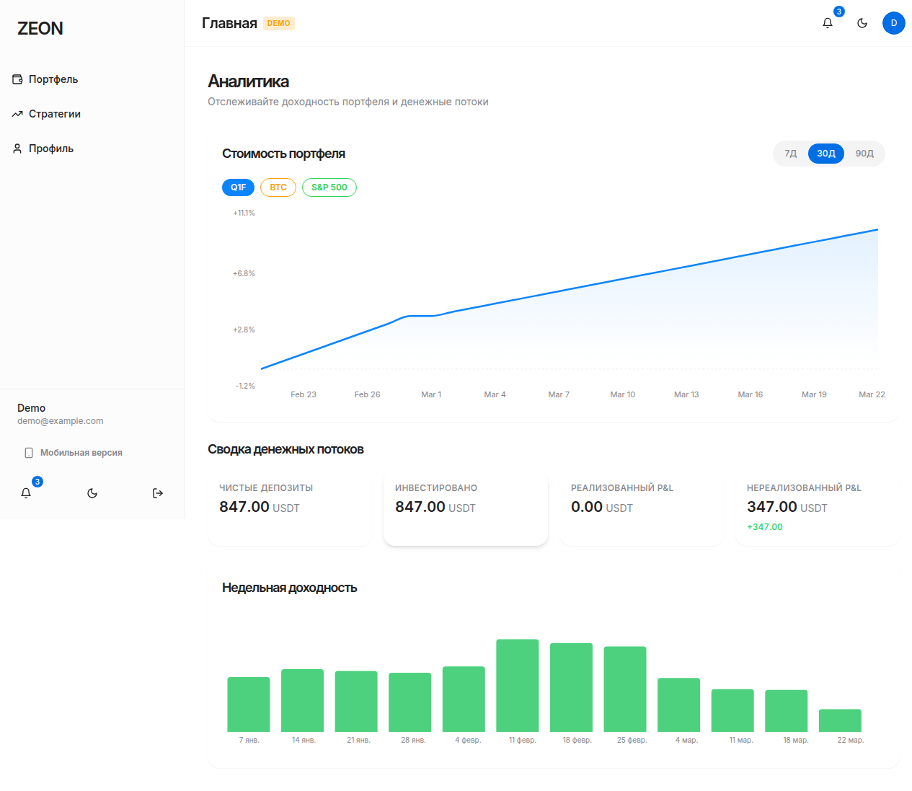

---

## 5. Административные User Cases

### UC-A01: Панель управления (Admin Dashboard)
**Актор:** Администратор
**Сценарий:**
1. Переходит на /admin
2. Видит метрики: Total Users, AUM (USDT), Pending Withdrawals, KYC Queue
3. Обзор состояния платформы

**Экран: Панель администратора**
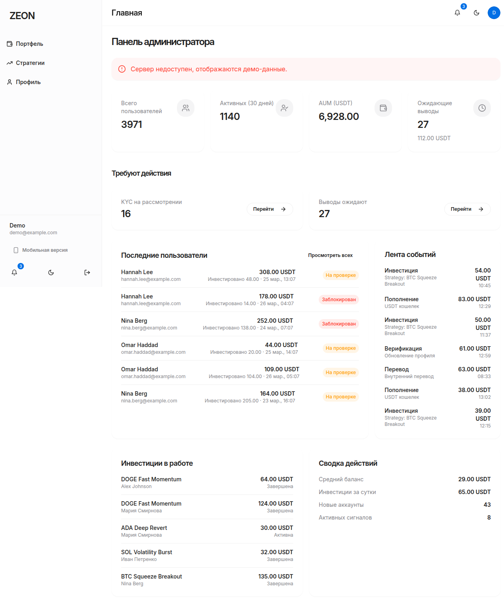

---

### UC-A02: Управление KYC
**Актор:** Администратор
**Сценарий:**
1. Переходит на /admin/kyc
2. Видит очередь заявок на верификацию
3. Для каждой заявки: просмотр документов
4. Действия: Approve, Reject, Request More Info
5. Каждое действие логируется в аудит

---

### UC-A03: Управление выводами
**Актор:** Администратор
**Сценарий:**
1. Переходит на /admin/withdrawals
2. Видит список ожидающих выводов
3. 4-eyes workflow: первый админ проверяет → второй одобряет
4. Может отклонить с указанием причины

---

### UC-A04: Управление пользователями
**Актор:** Администратор
**Сценарий:**
1. Поиск и просмотр пользователей
2. Просмотр детальной информации: баланс, позиции, операции
3. Блокировка/разблокировка аккаунта
4. Просмотр истории активности

---

### UC-A05: Управление комиссиями
**Актор:** Администратор
**Сценарий:**
1. Переходит на /admin/management-fees
2. Настройка комиссий платформы
3. Management Fee, Performance Fee

---

### UC-A06: Мониторинг движка
**Актор:** Администратор
**Сценарий:**
1. Просмотр здоровья торгового движка
2. Статус каждого engine-loop
3. Ошибки и предупреждения
4. Аудит-логи всех административных действий

---

## 6. Карта экранов (Screen Map)

| # | Экран | Путь | User Case | Скриншот |
|---|-------|------|-----------|----------|
| 1 | Лендинг (Hero) | / | UC-01 | 01-landing.png |
| 2 | Лендинг (Карточки) | / (scroll) | UC-01 | 01b-landing-features.png |
| 3 | Демо: Регистрация | /demo/register | UC-02 | 02-demo-register.png |
| 4 | Демо: Анкета | /demo/questionnaire | UC-02 | 19-demo-questionnaire.png |
| 5 | Демо: Рекомендация | /demo/recommendation | UC-02 | 20-demo-recommendation.png |
| 6 | Демо: Способ оплаты | /demo/funding | UC-02 | 21-demo-funding.png |
| 7 | Демо: Пополнение | /demo/deposit | UC-02 | 22-demo-deposit.png |
| 8 | Демо: Живой портфель | /demo/portfolio | UC-02 | 23-demo-portfolio.png |
| 9 | Онбординг | /onboarding | UC-03 | 24-onboarding.png |
| 10 | Портфель | / | UC-04 | 03-portfolio.png |
| 11 | Стратегии | /strategies | UC-05 | 04-strategies.png |
| 12 | Инвест-шит | /strategies (sheet) | UC-05 | 05-invest-sheet.png |
| 13 | Кошелёк | /wallet | UC-09 | 06-wallet.png |
| 14 | Пополнение USDT | /deposit/usdt | UC-07 | 07-deposit.png |
| 15 | Активность | /activity | UC-10 | 08-activity.png |
| 16 | Настройки | /settings | UC-13 | 09-settings.png |
| 17 | Безопасность | /settings/security | UC-12 | 10-security.png |
| 18 | Профиль | /profile | UC-13 | 11-profile.png |
| 19 | Аналитика | /analytics | UC-19 | 12-analytics.png |
| 20 | Статус системы | /status | UC-15 | 13-status.png |
| 21 | Q1F: Главная | /q1f | UC-18 | 14-q1f-home.png |
| 22 | Q1F: AI Инвест | /q1f (tab) | UC-18 | 15-q1f-invest.png |
| 23 | Admin: Dashboard | /admin | UC-A01 | 25-admin-dashboard.png |
| 24 | Входящие | /inbox | UC-16 | 26-inbox.png |
| 25 | Выписки | /statements | UC-14 | 27-statements.png |
| 26 | Управление рисками | /risk | UC-11 | 28-risk.png |

---

## 7. Дизайн-система

- **Стиль:** Apple-inspired (Q1F mockup)
- **Основной цвет:** #0071E3 (Apple Blue)
- **Positive:** #34C759, **Negative:** #FF3B30, **Warning:** #FF9F0A
- **Кнопки:** pill-shaped (rounded-full), active:scale-[0.98]
- **Карточки:** rounded-2xl, shadow-sm, hover:shadow-md
- **Навигация:** glassmorphism (backdrop-blur-xl, bg-background/80)
- **Шрифт:** SF Pro / system-ui
- **Тёмная тема:** поддерживается (переключатель в header)

---

## 8. Технический стек

| Компонент | Технология |
|-----------|-----------|
| Frontend | React 18, TypeScript, Vite, TailwindCSS, shadcn/ui |
| Routing | wouter |
| State/Data | TanStack Query v5 |
| Backend | Express.js, TypeScript |
| Database | PostgreSQL (Drizzle ORM) |
| Auth | Replit OIDC + демо-сессии |
| Real-time | Server-Sent Events (SSE) |
| Trading Engine | 14 стратегий, APScheduler-подобный планировщик |
| Telegram | Bot API + Mini App (TWA) |
| Charts | SVG sparklines, candlestick charts |
